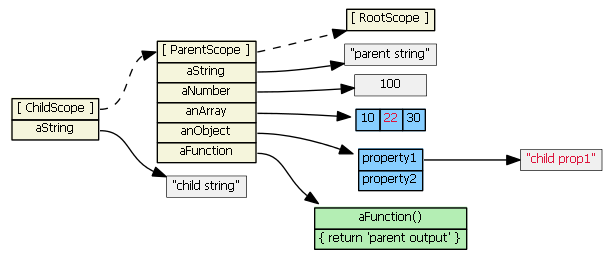

## Context ##
 >  #### JavaScript Prototypical Inheritance ####
 >  #### Angular Scope Inheritance ####
 >+  ng-include 
 >+  ng-switch 
 >+  ng-repeat 
 >+  ng-view 
 >+  ng-controller
 >+  ng-directive 

## Content ##
### 1. JavaScript Prototypical Inheritance ###
Suppose parentScope has properties aString, aNumber, anArray, anObject, and aFunction. If childScope prototypically inherits from parentScope, we have:


If we try to access a property defined on the parentScope from the child scope, JavaScript will first look in the child scope, not find the property, then look in the inherited scope, and find the property. If it didn't find the property in the parentScope, it would continue up the prototype chain...all the way up to the root scope. So, these are all true:
```javascript
childScope.aString === 'parent string'
childScope.anArray[1] === 20
childScope.anObject.property1 === 'parent prop1'
```
Suppose we then do this:
```javascript
childScope.aString = 'child string'
```
A new aString property is added to the childScope. This new property hides the parentScope property with the same name.


Suppose we then do this:
```javascript
childScope.anArray[1] = 22;
childScope.anObject.property1 = 'child prop1'
```
The objects (anArray and anObject) are not found in the childScope. The objects are found in the parentScope, and the property values are updated on the original objects. No new properties are added to the childScope; no new objects are created.


Suppose we then do this:
```javascript
childScope.anArray = [100, 555]
childScope.anObject = { name: 'Mark', country: 'USA' }
```
Child scope gets two new object properties that hide/shadow the parentScope object properties with the same names.


### 2. Angular Scope Inheritance ###
>+ The following create new scopes, and inherit prototypically: ng-repeat, ng-include, ng-switch, ng-view, ng-controller, directive with **scope: true**, directive with **transclude: true**.
>+ The following creates a new scope which does not inherit prototypically: directive with **scope: {...}**. This create an "isolate" scope instead.

> Note, by default, directives do not create new scope --i.e., the default is **scope:false**.

#### 2.1 ng-include ####
Suppose we have in our controller:
```javascript
$scope.myPrimitive = 50;
$scope.myObject = { aNumber: 11};
```
And in our HTML:
```html
<script type="text/ng-template" id="/tpl1.html">
    <input ng-model="myPrimitive">
</script>
<div ng-include src="'/tpl1.html'"></div>

<script type="text/ng-template" id="/tpl2.html">
    <input ng-model="myObject.aNumber">
</script>
<div ng-include src="'/tpl2.html'"></div>
```
Each ng-include generates a new child scope, which prototypically inherits from the parent scope.


Typing (say, "77") into the first input textbox causes the child scope to get a new myPrimitive scope property that hides/shadows the parent scope property of the same name. This is probably not what you want/expect.


Typing (say, "99") into the second input textbox does not result in a new child property. Because tpl2.html binds the model to **an object property**, prototypal inheritance kicks in when the ngModel looks for object myObject -- it finds it in the parent scope.


### 3. Summary ###
There are four types of scopes:
1. normal prototypal scope inheritance-- ng-include, ng-switch, ng-controller, directive with **scope:true**
2. normal prototypal scope inheritance with a copy/assignment -- ng-repeat. Each iteration of ng-repeat creates a new child scope, and that new child scope always gets a new property.
3. isolate scope -- directive with scope: {...}. This one is not prototypal, but '=', '@', and '&' provide a mechanism to access parent scope properties, via attributes.
4. transcluded scope -- directive with transclude: true. This one is also normal prototypal scope inheritance, but it is also a sibling of any isolate scope.

-----
### TODO

* [ ] Read following artical ["Inheritance and the prototype chain"](https://developer.mozilla.org/en-US/docs/Web/JavaScript/Inheritance_and_the_prototype_chain).

---
**Reference**
> [Understanding Scopes][2]

[2]:https://github.com/angular/angular.js/wiki/Understanding-Scopes